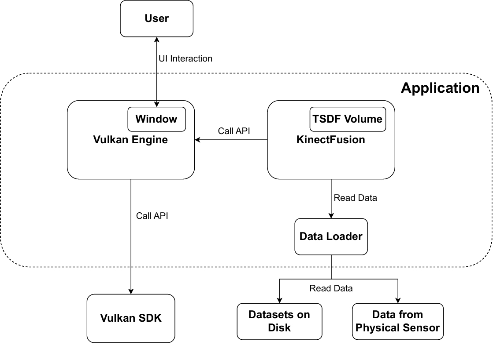

# KinectFusion-Vulkan
Implementation of KinectFusion based on Vulkan.

## Dependencies

- [Vulkan SDK](https://www.vulkan.org/)
- [GLFW](https://www.glfw.org/)
- [Eigen](https://eigen.tuxfamily.org/index.php?title=Main_Page)
- [ImGui](https://github.com/ocornut/imgui)
- [Vulkan Memory Allocator](https://github.com/GPUOpen-LibrariesAndSDKs/VulkanMemoryAllocator)
- [STB Image](https://github.com/nothings/stb)
- [argparse](https://github.com/p-ranav/argparse/tree/master)
- [jjyouLib](https://github.com/YJJfish/jjyouLib)

You only need to install Vulkan SDK. Other dependencies are already included as submodules in this repository.

## Build

We provide `CMakeLists.txt` to build the project. Before cmake, install Vulkan SDK, and clone this repository recursively with its submodules.

## Usage

**Application settings:**

- `-h`, `--help`: Show help message and exit.
- `-v`, `--version`: Print version information and exit.
- `--debug`: Enable debug mode. Debug mode will enable the Vulkan validation layer but will have much lower performance.

**KinectFusion parameters:**

- `--truncation-weight w`: Set the truncation weight. Rarely modified.
- `--volume-resolution nx ny nz`: Set the resolution of TSDF volume. Rarely modified. Set smaller values if your GPU memory is not enough.
- `--volume-size s`: Set the size of voxels in TSDF volume.
- `--volume-corner cx cy cz`: Set the coordinate of the corner voxel's center point. Rarely modified.
- `--truncation-distance d`: Set the truncation distance of TSDF. Rarely modified.
- `--sigma-color s`: Set the sigma color term in bilateral filtering.
- `--sigma-space s`: Set the sigma space term in bilateral filtering.
- `--filter-kernel-size`: Set the kernel size of bilateral filtering.
- `--distance-threshold t`: Set the distance threshold used in projective correspondence search in ICP.
- `--angle-threshold t`: Set the angle threshold used in projective correspondence search in ICP.

**Dataset loading:**

- `--dataset`: Specify the input dataset. We provide two types of dataset`VirtualDataLoader` and `TUM`.
- `--dataset VirtualDataLoader` synthesizes RGB-D data of a cube. This is can be used to test whether the program can run on your device.
  - `--VirtualDataLoader.extent w h`: Set the input image size.
  - `--VirtualDataLoader.center cx cy cz`: Set the center position of the synthesized cube.
  - `--VirtualDataLoader.length l`: Set the edge length of the synthesized cube.
- `--dataset TUM` loads a [TUM RGB-D dataset](https://cvg.cit.tum.de/data/datasets/rgbd-dataset/download) from the disk.
  - `--TUM.path /path/to/the/dataset/`: Set the path to the dataset.

## Results

The project is developed on Windows, and tested on Windows/Ubuntu/MacOS.

The following table shows the FPS on different platforms:

| Platform                             | FPS   |
| ------------------------------------ | ----- |
| Windows (NVIDIA Geforce RTX 2060)    | 30-40 |
| Ubuntu (NVIDIA Geforce GTX 1080)     | 20-30 |
| MacOS (Intel Iris Plus Graphics 640) | 5-10  |

We show our results on [TUM RGB-D datasets](https://cvg.cit.tum.de/data/datasets/rgbd-dataset/download).

- Real-time tracking and fusing:

  

  

- Interactive scene viewer:

  

- AR composition (the red sphere):

  

  

## Advanced

### Implementation details

### Implement your own data loader

Our implementation uses a virtual base class `DataLoader` to load data. In this way we can decouple the data loading from other modules.

Our program supports two types of data loader: `VirtualDataLoader` that synthesizes RGB-D data of a virtual cube, and `TUMDataset` that loads a [TUM RGB-D dataset](https://cvg.cit.tum.de/data/datasets/rgbd-dataset/download) from the disk.

You may wish to implement your own data loader to load other datasets or read data from a physical RGB-D sensor. To achieve this, you need to implement a class deriving from the `DataLoader` class in `DataLoader.hpp`, and instantiate it in `Application.cpp`.

### Graphics rendering

In our implementation, graphics rendering are handled by the `Engine` class. It is responsible for initializing Vulkan, creating rendering resources, and rendering contents to the swapchain. Currently it only supports simple material (position + color) and Lambertian material (position + color + normal). You can modify this class if you want to add more rendering effects (e.g. texture, lighting, PBR, etc.).

### Improve KinectFusion

In our implementation, tasks related to KinectFusion (e.g. ray casting, pose estimation, fusion) are all handled by the `KinectFusion` class. You can modify this class if you want to modify the algorithm (e.g. voxel hashing).

### Other uses

You can replace our `Application` class if you want to use KinectFusion for other uses.

## References

[1] Newcombe, R., et al, "KinectFusion: Real-time dense surface mapping and tracking," in *2011 10th IEEE International Symposium on Mixed and Augmented Reality*, 2011, pp. 127-136.

[2] J. Sturm, undefined., et al, "A Benchmark for the Evaluation of RGB-D SLAM Systems," in *Proc. of the International Conference on Intelligent Robot Systems (IROS)*, 2012.
